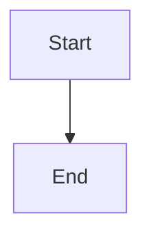

# AzaDocs

A personal markdown library. Browse a nested file tree, search across every
document's contents, and edit in place — with Mermaid diagrams, LaTeX and
Jupyter notebooks rendered inline.

Live at **<https://md.azaken.com>**.

- Vanilla JavaScript on the client. No framework, and no build step needed —
  there is an optional one that bundles what a page already loads.
- Notebook code cells run Python in the browser via Pyodide, on request.
- A Links section for the docs sites you keep coming back to, saved as cards
  carrying each page's own title and description, filed into groups.
- Documents are edited in place, on the page you read them on — tables as
  tables, code as code — rewriting only the blocks you actually touch, or as
  markdown source, one button away.
- Task list checkboxes are live while you read: click one and that single
  character changes in the file, with no editor to open and nothing to save.
- Screenshots can be pasted or dropped straight into a document, stored by
  content hash so the same picture is only ever kept once.
- Express 5 on the server, with the documents themselves as the source of truth
  and JSON files for folder structure, accounts and sessions.
- Every document has a real address — `/Azalea/Roadmap/day-008.md` — that can
  be typed, refreshed and shared, with all navigation staying on one page.
- Private by default: accounts with roles, and individual documents can be
  published as standalone share links.

---

## Running it

Requires Node 20 or newer.

```bash
npm install
npm start
```

Then open <http://localhost:4321>.

On first boot, with no accounts, the server creates an admin with a password
it makes up on the spot and prints once:

```
  No accounts existed, so an admin was created:

      username: aza
      password: k3n9Q2xWv8mLp0Ra

  That password was generated just now and is printed here once.
  It is not stored anywhere in the clear. You will be required to
  change it at first login; if this line has gone to a log you do
  not control, do that soon.
```

It used to be a constant, in the source and in this README, and the app was
honest about that — but between first boot and first login a known username
and a known password authenticated, and on a host reachable from the internet
that window is however long it takes to boot the app and get distracted. Now
there is nothing to know. For a scripted setup, set `SEED_ADMIN_PASSWORD` and
the server uses that instead and prints only the variable's name, so the value
never enters a log; the forced change at first login applies either way.

Sign in with those, and the app will make you replace the password before it
lets you do anything else — that password is in this file, so treat it as
already known to everyone.

### Types, without TypeScript

There is no TypeScript and no compile step: what the browser loads is what is
in the repository. The types are JSDoc comments in the source — `@typedef` for
the shapes that cross module boundaries (the diagram model, the user and
session records, a link preview, `req.auth`) and `@param`/`@returns` where a
signature is not obvious — checked by `tsc --checkJs` through `jsconfig.json`.
`npm run typecheck` runs it, and CI runs it after lint.

Two things follow from wanting that check. Each browser module is
`var Name = (function () { ... return { ... }; })();` rather than assigning to
`window`, because a top-level `var` is a declaration the checker can read the
type of, and a classic script's top-level `var` is still a property of the
window, so nothing about how the page loads has changed. And ESLint allows
`var` at the top level of those files and nowhere else, which is the rule that
keeps it to that one use.

`strict` is off. This is a check for the mistake that spans two files — a field
added to the model in one place and not read in another — not an exhaustive
proof, and the error count had to be something a person could finish.

The names that arrive from outside the source — the CDN libraries, the worker's
own scope, `req.auth` — are declared in `types/globals.d.ts`.

### How complicated a function may get

ESLint warns — not errors — about a function that is too branchy (`complexity`
15), too long (120 lines), too deeply nested (4) or takes too many arguments
(5). That severity is deliberate: a long function is sometimes exactly right,
and an error there is a rule to be argued with rather than advice to be read.

The rules went in with seventy-four warnings outstanding. There are none now,
and the `limits` suite keeps it that way: it runs ESLint and fails if the
count is above zero, so a function that grows past a limit shows up as a
failing check rather than in a list nobody reads. Raising one of those numbers
is a decision, to be made in a commit that says why.

What they bought, in order of how much the next person would have thanked us:
the diagram editor's keyboard dispatcher (complexity 62) and its pointer
handler (53), the two halves of the diagram file format — `parseFlowchart`
(59) and `serializeFlowchart` (67) — the tree's keyboard handler (55) and the
markdown block splitter (51), each now a named piece per thing it handles: a
table of commands, one scanner per kind of block, one reader per kind of line.
Then the seven route modules, where every handler moved out of its factory and
takes the same injected dependencies, so what is left in `create…Routes` is
the list of addresses and who may use them. Then two dozen smaller ones, most
of which became a table: what a shape costs to draw, what a search match is
worth, what each kind of notebook output looks like.

Four places answered the rules instead of satisfying them, with a disable and
a reason above it: the diagram editor's `mount`, the guards, the document
store and the search index. Each was a module written as one long closure —
what the rule saw was a huge function, and what was there was a module — which
was true, and still left four functions nobody could read. So each is now the
thing it said it was. The three on the server keep their state in an object
the module builds and their functions take it, and the factory returns the few
of them the rest of the app calls. The diagram editor does the same with `ed`:
one editor is one `ed`, every function takes it first, and `mount` is six named
steps — start the state, bind the canvas, build the rail, build the bar, put it
together, hand back the handle. The `limits` suite holds the list of places
that switch a limit off, and the list is now empty, so the first one is a
change to that file rather than a quiet addition. A test suite is exempt for a
different reason: it is a script, and its branches are its checks.

### Markup built as strings

There are about a hundred assignments to `innerHTML` in the client — a button
with an icon in it, a row with a filename on it — and there is no framework
here to hide them. Rendered markdown goes through DOMPurify and a diagram's
SVG escapes its own labels, so the interesting question was never whether
today's hundred are safe; it was what stops the hundred-and-first.

`eslint-plugin-no-unsanitized` stops it. `no-unsanitized/property` permits a
static string and refuses one built out of a value, which is exactly the line
that matters, and the one way past it is `html` in
[`public/js/dom-html.js`](public/js/dom-html.js):

```js
node.innerHTML = html`<i class="ph ${icon}"></i><span>${label}</span>`;
```

Every interpolation is escaped; an array is joined as markup, which is how a
list is built from `.map(one => html`…`)`; and `trusted(value)` is the one way
to put markup inside markup, so `grep trusted public/js` lists every place
something other than that file did the escaping. Markup that was sanitized
elsewhere — DOMPurify's output, highlight.js's spans, a diagram this app drew
— assigns directly with an `eslint-disable-next-line` naming the reason. The
`headers` suite checks that the rule is on, that the helper escapes what it
promises to, and that every opt-out has a sentence above it.

### One owner for a rule two pages apply

Four pages have a theme and only two of them load `app.js`, so the cycle, the
key it is remembered under, the resolving of `auto` and the
`<meta name="theme-color">` all live in
[`theme-boot.js`](public/js/theme-boot.js) — the script that already runs in
`<head>` on every one of them. `app/theme.js` and `share.js` call it.

That was not free advice. `share.js` had carried its own copy of all four, and
the copy had fallen behind: `ThemeSwitch.apply` moves the `theme-color` meta
and `share.html` has one, so switching the theme on a shared document left the
browser chrome on the colour it had before. Consolidating fixed it, which is
the argument for consolidating. The `theme` suite now checks that neither page
keeps a second copy.

The same shape twice more:

- The Mermaid repaint. A theme change means drawing every diagram again — four
  steps in an order that matters — and it was written out in both
  `app/theme.js` and `share.js`. It is now `repaintMermaidForTheme` in the
  render engine, which both pages hand their own panels to.
- `escapeHtml`. The server filled its four HTML templates with its own six
  lines of it, and the two had drifted: the server wrote `String(value || "")`,
  so a substitution of `0` or `false` escaped to nothing at all, while the
  client wrote `?? ""` and escaped it to `"0"`. `lib/http/html.js` now requires
  [`public/js/dom-html.js`](public/js/dom-html.js), the way `lib/docs/paths.js`
  already requires `doc-kinds.js` — a plain script in the browser and a
  CommonJS module on the server, which is the seam for the two rules about text
  that both sides have to apply the same way. The `headers` suite runs both
  through the same inputs.

The render engine deliberately does **not** join in: it reads `data-theme` off
`<html>` rather than calling `ThemeSwitch`, because it renders the same
documents on the share page, where most of the app's globals are not loaded. A
renderer that needs one of them is a renderer that works on one page.

### What the linter is asked to catch

`@eslint/js` recommended, plus the rules that catch a class of bug rather than
a habit: `eqeqeq`, `no-var`, `prefer-const`, `require-atomic-updates` (a
missing `await` on a write is data loss, not style), `no-unsanitized/property`
above, and `no-console` on the client only — `console.error` in a catch is how
this app reports a renderer falling over, a `console.log` is something
somebody forgot.

`eslint-plugin-security` is on selectively, and the selection is written down
in `eslint.config.js` rather than left to be rediscovered. Nine of its rules
report nothing here and are errors, which is the point: each refuses a thing
this app has no business doing, starting with the first time somebody does it.
Three more are off because they are a syntax census rather than a finding —
`detect-object-injection` flags every `obj[key]` (230), and
`detect-non-literal-fs-filename` flags every `fs` call in a file server (130),
where what actually stops traversal is `resolveDocPath` and `sanitizeFilename`
and the suites that test them.

The one that earned its place is `detect-unsafe-regex`. It found a real bug:
`decodeDataUri` in [`lib/link-preview.js`](lib/link-preview.js) read a `data:`
URI's parameters with `(?:;[^,]*)*`, where a parameter could itself contain
the separator — so `data:image/png;a;a;a…` with no comma had exponentially
many readings. Twenty-four of them took a quarter of a second, forty would
have taken hours, and the address comes off a page a stranger asked the server
to preview. It is now `(?:;[^,;]*)*`, which can be read one way, and the same
input takes half a millisecond. The plugin reports twelve more; each was
handed sixty thousand characters down the path that has to fail and the worst
took two milliseconds. That list is pinned in the `limits` suite, so the
fourteenth is a regex somebody has to look at.

`no-await-in-loop` is the one suggestion that was declined, with the audit
instead of a shrug: all twenty-seven loops outside the test suites were read,
and none of them is the N-round-trips-that-should-be-`Promise.all` the rule is
for. Most are sequential because the iteration before allocates a filename the
next one must see; some stop early; two are bounded worker pools already
running under `Promise.all`, which is the shape the rule wants and cannot see.
Twenty-seven disables would have said less than the paragraph in the config
does.

ESLint and its two plugins are pinned to exact versions. A major version of a
linter changes what CI accepts without anybody changing a line of source, and
that should be a commit.

### Dependencies, and the ones `npm audit` cannot see

The runtime surface is four packages — `express`, `multer`, `better-sqlite3`,
`graphql` — and it is kept that small on purpose. CI runs `npm audit
--audit-level=high` after lint, so a high or critical advisory fails the build
and a lower one shows in the log; Dependabot opens a weekly pull request for
anything behind.

That covers `package.json` and nothing else. Eight more libraries arrive in the
browser as `<script>` tags or lazily fetched URLs, and `npm audit` had never
looked at one of them:

| | version | loaded by | when |
| --- | --- | --- | --- |
| marked | 15.0.12 | index, share | eagerly — nothing renders without it |
| DOMPurify | 3.4.16 | index, share | eagerly — same |
| @phosphor-icons/web | 2.1.2 | every page | eagerly, as CSS |
| mermaid | 11.16.1 | `md/lazy.js` | first diagram |
| KaTeX | 0.16.47 | `md/lazy.js` | first equation |
| highlight.js | 11.11.1 | `md/lazy.js` | first code block |
| svg-pan-zoom | 3.6.1 | `md/lazy.js` | first diagram |
| pyodide | 314.0.3 | `pyodide-worker.js` | first Python cell |

Every one is pinned to an exact version and checked with subresource
integrity, which stops a compromised CDN serving different bytes — and does
nothing at all about a vulnerability in the library itself.

`npm run audit:cdn` closes that. It reads the versions back out of the source
rather than from a list beside it, writes them into a manifest nobody installs,
and asks the same advisory database the real audit uses. It also fetches each
pinned asset and checks the bytes against the hash beside it, because bumping
a version means editing a URL and an opaque string next to it, and getting the
second one wrong is a script the browser silently refuses to run. CI runs it
after `npm audit`, at `--level=moderate` rather than high: this is eight
packages, all of them running in a reader's browser over somebody else's
document, so the noise is bounded and the blast radius is not.

The first run was not academic. DOMPurify was pinned at 3.1.6 with **twenty
XSS advisories** outstanding against it — in the one library whose entire job
here is refusing a document's script — and KaTeX at 0.16.11, where `\htmlData`
did not validate attribute names. Both are now on the fixed versions.

### The sanitizer, actually run

Six suites render markdown and all six stub DOMPurify with
`{ sanitize: (html) => html }`, which is right for what each of them is testing
and meant the app's real defence against a document carrying a script was never
once exercised. DOMPurify is now a devDependency, pinned to the same version
the pages load — the `sanitizer` suite checks that those two agree first, then
takes the options out of `md/lazy.js` and runs the real thing.

Thirteen payloads go in and nothing executable comes out. The more useful half
is what the suite writes down about the things that *do* survive, each of which
looks wrong until you find the layer that actually stops it:

- A `<form>` is on DOMPurify's default allow-list, so a shared document can
  render something that looks like a sign-in box. `form-action 'self'` in the
  CSP is what stops it posting anywhere.
- `ADD_DATA_URI_TAGS: ["img"]` is what makes a pasted image work, and it allows
  any `data:` type on an `` — the image-type list in
  `ALLOWED_URI_REGEXP` does not gate that tag. A browser will not run HTML it
  was handed as an image, so this is a thing to know rather than a hole.
- A `data:` image is allowed on an `<a>`, where every current browser refuses
  a top-level navigation to `data:`.

The libraries the browser loads from a CDN are not in `package.json`, so
`npm audit` never sees them. They are pinned to exact versions and checked by
SRI hash, which defends against a compromised CDN but not against a
vulnerability in the library itself. This is the list to check an advisory
against:

| Library | Version | Loaded |
| --- | --- | --- |
| marked | 15.0.12 | on every page |
| DOMPurify | 3.1.6 | on every page |
| Phosphor icons | 2.1.2 | on every page |
| Mermaid | 11.16.1 | only when a document has a diagram |
| KaTeX | 0.16.11 | only when a document has maths |
| highlight.js | 11.11.1 | only when a document has code |
| svg-pan-zoom | 3.6.1 | only when a diagram is drawn |
| Pyodide | 314.0.3 | only when a notebook cell is run |

Bumping one means changing the version in the tag and recomputing the hash —
`public/index.html` says how, beside the tags.

### Scripts

| Script | What it does |
| --- | --- |
| `npm start` | Run the server |
| `npm run build` | Optional: bundle each page's scripts and stylesheets into one of each |
| `npm test` | Run every test suite |
| `npm run coverage` | The same suite under c8; the report of what it never reaches lands in `coverage/` |
| `npm test <suite>` | Run one suite: `layout`, `mobile`, `theme`, `diagrams`, `loading`, `auth`, `links`, `assets`, `code`, `audit`, `headers`, `graphql`, `limiter`, `doc-kinds`, `search`, `db`, `recycle`, `limits`, `build`, `visual`, `dom`, `diagram-page` |
| `npm run images` | Redraw the PNGs that link previews use |
| `npm run lint` | ESLint over the server, the client and the tests |
| `npm run lint:fix` | The same, applying the fixes it can |
| `npm run typecheck` | Check the JSDoc types with `tsc --checkJs`. No TypeScript, no build |
| `npm run audit:cdn` | Advisories and integrity for the eight libraries loaded from a CDN, which `npm audit` cannot see |

---

## Configuration

Everything is environment variables; there is no config file. For running this
somewhere — the `Dockerfile`, a compose file, a worked nginx and Caddy setup,
what to back up and what to watch — see
[docs/OPERATIONS.md](docs/OPERATIONS.md). Two of the variables below decide
more than their names suggest, and that page says which and why.

| Variable | Default | What it does |
| --- | --- | --- |
| `PORT` | `4321` | Port to listen on. |
| `PUBLIC_READS` | `false` | When `true`, anyone can read every document without signing in — the behaviour before accounts existed. Leave it off unless you want the whole library public; individual documents can be shared without it. |
| `PUBLIC_BASE_URL` | `https://md.azaken.com` | Origin used to build canonical, `og:*` and oEmbed URLs. Set it to `http://localhost:4321` when working locally if you want link previews to point at your own machine. |
| `TRUST_PROXY` | `false` | Set to `true` (or an Express trust-proxy value like `loopback`) only when running behind a reverse proxy. Controls whether `X-Forwarded-*` is honoured. |
| `AUDIT_LOG` | `data/audit.jsonl` | Where the security events go: a path, `stderr` to hand them to whatever collects the process's output, or `off`. |
| `SEED_ADMIN_PASSWORD` | *(generated)* | The first admin's password, for a scripted setup. Used only when no account exists yet; not echoed to the log. Without it one is generated and printed once at first boot. |
| `ALLOWED_ORIGINS` | *(none)* | Extra origins the CSRF origin check accepts, comma-separated, for a deployment reached under more than one name. `PUBLIC_BASE_URL` and loopback on `PORT` are always accepted. |
| `MDVIEWER_STATE_DIR` | the checkout | Moves the documents, recycle bin and organizer somewhere else, so runtime state can live outside the repo. The test suite uses it to point at a temp directory. |
| `LOG_REQUESTS` | `true` | One log line per request, written when the response finishes. |
| `LOG_LEVEL` | `info` | `debug`, `info`, `warn` or `error`. How the volume comes down without a deploy. |
| `LOG_FORMAT` | `text` | `text` for a person reading `docker compose logs`, `json` for something collecting it. |
| `METRICS_TOKEN` | *(none)* | Turns on `/metrics` and is the bearer token it wants. Unset, that route is a 404. |
| `LOG_STATIC` | `false` | Include static assets in that log. Off by default because they drown out everything else. |
| `ENABLE_GRAPHQL_INTROSPECTION` | `false` | Re-enables GraphQL schema introspection for local schema work. |

### Rate limits

Every ceiling is a fixed window of one minute, and every one is a ceiling
against a runaway rather than a security boundary — the guards are the
boundary. They are set in one place at the top of `server.js` and mounted in
one place beside it, so what is limited is answerable without reading a route.

| What | Per | Budget |
| --- | --- | --- |
| State changes on `/api/*` (POST, PUT, PATCH, DELETE) | account, or address with no session | 300, or 60 |
| Saves — `POST /api/docs`, `PUT /api/docs/…` | account | 120 |
| Uploads — a document, a folder, a pasted image | account | 30 |
| `GET /api/docs/search` | account | 240 |
| Link previews fetched from elsewhere | account | 20 |
| `/healthz`, which needs no session, and `/graphql` | address | 60 |

Reads are not counted by the wide ceiling on purpose. The client reads a great
deal — it fetches every document once to warm its offline search — and that
grows with the library, so a cap on reads low enough to mean anything would
break it and one high enough to allow it would mean nothing. The reads that
cost something have the buckets above.

A refusal is a `429` with a `Retry-After` header and a message saying which
budget ran out. The map behind each bucket is capped at ten thousand keys, so
a caller presenting addresses by the thousand fills it and is forgotten rather
than growing it. The limits are per process: under two, every ceiling is
twice as high, which for a ceiling is fine.

The login lockout is the one limit that is a boundary rather than a ceiling,
and it is the one that does not work this way. Eight wrong guesses in fifteen
minutes lock an account for fifteen; forty from one address lock the address.
The count lives in the database, so a restart does not reset it — a crash loop
or a redeploy used to turn the lockout into a speed bump — and two processes
share one count rather than each allowing eight. The `db` suite checks all
three.

### The audit log

The request log says what was asked and how it was answered. It does not say
who signed in from where, whose password was changed by whom, or who erased a
document — so after an incident, "what did this account do before we
noticed?" had no answer. `data/audit.jsonl` is the answer: one JSON line per
event that matters, appended, owner-readable only.

| Event | When |
| --- | --- |
| `login.ok`, `login.failed`, `login.refused` | a sign-in, a wrong guess (with the reason the response never gives: no such user, disabled, bad password), a guess made while locked |
| `login.locked` | the guess that locked an account or an address, and for how long |
| `permission.denied` | a signed-in account asking for what its role does not allow — a viewer trying to write |
| `share.created`, `share.rotated`, `share.revoked` | a share link's life; rotation is how a leaked link is revoked |
| `password.changed`, `password.change.failed` | by the owner or by an admin; and a wrong current password, which is a guess from inside a session |
| `user.created`, `user.role`, `user.disabled`, `user.enabled`, `user.deleted` | what changed about an account, and by whom |
| `doc.erased` | the one thing here that cannot be undone |

Every line carries who (the signed-in account, when there is one), the
address, and a user agent cut to 120 characters. Never a document's text, a
search term, a token, a password or a hash of one — the `audit` suite walks a
server through all of the above and then searches the log for each of those
and requires them absent. Reads and saves write no line: the log is for what
an incident review asks about, not a second request log.

`AUDIT_LOG=stderr` hands the lines to whatever collects the process's output,
for a deployment that ships logs somewhere; the default is a file because the
point is to still have it later.

### Notes on the public deployment

The canonical origin is baked in rather than read from the request. A `Host`
header is attacker-controlled, and building the canonical or oEmbed URL from it
lets someone else decide where a link preview points. `PUBLIC_BASE_URL`
overrides the default; nothing else does.

Behind a reverse proxy, set `TRUST_PROXY` — otherwise `req.protocol` reports the
proxy hop rather than the client's scheme.

A write that arrives with an `Origin` header has to name an origin this
deployment answers on: `PUBLIC_BASE_URL`, anything in `ALLOWED_ORIGINS`, or
loopback on `PORT`. That list is configuration, not something read off the
request, and the check no longer switches itself off under `TRUST_PROXY` — it
used to, on the grounds that behind a proxy the request's own idea of its
origin could differ from the public one, which meant the deployment that
most needed the check was the one without it. It is the layer in front of
the CSRF token, not the only lock.

Every response carries the same set of headers — a Content Security Policy,
`nosniff`, a referrer policy, `X-Frame-Options`, a same-origin opener policy
and resource policy, and a permissions policy that denies the camera, the
microphone, location, USB and payment — including static files, errors and
refused API calls, because a policy that covers only the pages somebody
remembered to cover is not a policy. They live in `lib/http/headers.js` with
the reason for each, and the `headers` suite asks eight kinds of response for
the set.

The Content Security Policy allows no inline or evaluated *script*. It does
allow inline *styles* — `style-src 'unsafe-inline'` — and that is a deliberate
trade with three reasons, all of them checked by the `headers` suite so the
allowance expires the day none of them holds: the app's own diagram drawing
writes `style` attributes whose values come from the document (a box's colour
from its `classDef`), which no hash can cover and no nonce applies to, since
nonces cover `<style>` elements and never attributes; KaTeX sets inline style
attributes on what it typesets; and Mermaid injects a `<style>` into every SVG
it renders. Styles cannot execute; what style injection can do is redress the
page, and scripts — the vector that matters — stay pinned to this origin and
two SRI-checked CDNs.

`Strict-Transport-Security` is the one that depends on the deployment. It is
sent when `PUBLIC_BASE_URL` is HTTPS and not otherwise: a plain-HTTP box that
sent it would tell the browser never to come back the way it can. A year,
with subdomains, and without `preload` — that submits the domain to a list
browsers ship with and is effectively irreversible, so it is a decision to
make on purpose.

The resource policy means the app's own responses — a pasted image, an icon,
the embed card — cannot be embedded by a page on another origin. A crawler
fetching `og:image` for a link preview is a server, not a browser, and is not
affected.

---

## Project structure

```
├── public/
│   ├── index.html            # The whole app shell. Embed meta is templated in at request time.
│   ├── css/app.css           # One stylesheet. Design tokens at the top, light + dark.
│   ├── share.html            # The standalone share page
│   ├── error.html            # 404 and friends, for browsers
│   ├── js/
│   │   ├── app.js            # Wires the modules below together and boots
│   │   ├── app/              # What the client is made of
│   │   │   ├── text.js       # Title, icon, size, sort order — from a name alone
│   │   │   ├── dom.js        # Every element the interface reaches for
│   │   │   ├── state.js      # The one object the interface is drawn from
│   │   │   ├── api.js        # Every request, and what a 401 or 403 means
│   │   │   ├── library.js    # Which document, which folder, what shape the tree is
│   │   │   ├── search.js     # Scoring the corpus against a typed query
│   │   │   ├── location.js   # The address bar
│   │   │   ├── selection.js  # Click, Ctrl-click, Shift-range
│   │   │   ├── tooltips.js   # One body-level tooltip, adopted from title=
│   │   │   ├── modal.js      # Focus containment, as a stack of layers
│   │   │   ├── shell.js      # Sidebar open, body lock, the search meta line
│   │   │   ├── notify.js     # Toasts, and the confirmation dialog
│   │   │   ├── links.js      # Saved links
│   │   │   ├── share.js      # Share links
│   │   │   └── pasted-images.js  # A screenshot becomes an image link
│   │   ├── doc-kinds.js          # What a document is, by its name — loaded by the server too
│   │   ├── dom-html.js           # The html`` tag: escaping for markup built as strings
│   ├── markdown-core.js  # Render engine shared by both pages
│   │   ├── visual-editor.js  # Block splitting + markdown serialization
│   │   ├── diagram-model.js  # Mermaid flowcharts as steps, arrows and positions
│   │   ├── diagram-draw.js   # Draws the ones that carry their own layout
│   │   ├── notebook-runtime.js   # Talks to the Python worker
│   │   ├── pyodide-worker.js     # Python (Pyodide/WASM), isolated from the DOM
│   │   ├── share.js          # The share page
│   │   └── theme-boot.js     # Applies the stored theme before first paint
│   ├── favicon.svg
│   ├── img/                  # PNGs for link previews (see npm run images)
│   └── docs/                 # Your documents, in folders (gitignored)
├── lib/
│   ├── docs/                 # The library as it exists on disk
│   │   ├── paths.js          # Sanitizing and resolving a document path
│   │   ├── store.js          # Files, folders on disk, recycle, uniqueness
│   │   ├── organizer.js      # The folder tree and the file that records it
│   │   ├── search.js         # Scoring documents server-side
│   │   └── content.js        # The read caches
│   ├── http/                 # The shapes a response can take
│   │   ├── headers.js        # CSP and the rest of the security headers
│   │   ├── logging.js        # The request log
│   │   ├── errors.js         # HttpError, the error page, the handler
│   │   ├── html.js           # Escaping and the template cache
│   │   ├── urls.js           # Absolute URLs and the base-URL resolver
│   │   └── embed.js          # og:/twitter: meta for a document
│   ├── routes/               # The addresses, one router per area
│   │   └── auth.js users.js docs.js folders.js recycle.js shares.js
│   │       links.js assets.js upload.js meta.js pages.js
│   ├── guards.js             # Who may: sessions, CSRF, permissions
│   ├── auth.js               # Accounts, sessions, RBAC, login rate limiting
│   ├── excerpt.js            # Title and summary for link previews
│   ├── link-preview.js       # Fetches a URL safely and reads its og: tags
│   ├── links.js              # Saved links
│   ├── db.js                 # The one SQLite database the metadata lives in
│   ├── lru.js                # The byte-budgeted cache the read caches use
│   ├── passwords.js          # scrypt hashing and the password policy
│   ├── shares.js             # Per-document share links
│   └── site.js               # The name and icons this site calls itself by
├── data/                     # All gitignored
│   ├── azadocs.db            # The metadata: accounts, sessions (ids hashed),
│   │                         # share links (tokens hashed), saved links, and
│   │                         # the folder tree. SQLite, WAL mode; see lib/db.js
│   └── *.json.imported       # The files those used to be, set aside on first boot
├── deleted_markdowns/
│   ├── soft/                 # Recycle bin (gitignored)
│   └── hard/                 # Archive (gitignored)
├── assets/                   # Pasted images, named by content hash (gitignored)
├── test/
│   ├── run.js                # Runner: `npm test`
│   ├── helpers/server.js     # Spawns a real server against a temp state dir
│   ├── app-source.js         # Reads the client's script order out of index.html
│   └── *.test.js             # The twenty-one suites
├── tools/
│   └── make-embed-images.js  # Draws public/img/*.png. No dependencies.
├── types/                    # What the checker cannot read off the source
├── server.js                 # Configuration, middleware order, mounts, boot
├── eslint.config.js
├── jsconfig.json             # `npm run typecheck`: checkJs over everything
├── package.json
├── package-lock.json         # Tracked — `npm ci` needs it
└── .github/workflows/ci.yml
```

`public/docs/`, `data/`, `deleted_markdowns/` and `assets/` are gitignored: they
are your documents and your runtime state, not part of the project. The server
recreates them on boot.

> **The database has no backup.** `data/azadocs.db` holds the accounts, the
> share links and the folder tree, and it is gitignored, so nothing
> version-controls it. Losing it no longer loses which documents are in which
> folder — the directories say that — but it does lose every account, every
> share link and the folders' ids and ordering. Back it up if you care about
> those: it is one file, and `sqlite3 data/azadocs.db ".backup copy.db"` takes
> a consistent copy while the app is running.

### How the client is put together

`app.js` is the last script the page loads and the only one that wires anything:
it names what the modules in `public/js/app/` export, registers the listeners,
and boots. Everything it still contains is on its way out to a module of its
own.

A module is a plain script that closes over its own names and puts one object on
the page:

```js
(function (global) {
  const { state } = global.AppState;

  function setSelection(files) { /* ... */ }

  global.AppSelection = { setSelection };
})(typeof window === "undefined" ? globalThis : window);
```

Two rules keep that honest. A module takes what it needs from the namespaces at
the top, never from whatever happens to be in scope by the time it runs — which
is why `index.html` is the one place that says what loads in what order, and why
the tests read that order out of the page rather than keeping a list of their
own. And a module reaches downward only: `notify.js` is handed the modal layers,
the modal layers know nothing about toasts.

**Not ES modules**, though `import`/`export` would state the order better than a
script tag can. jsdom does not execute `<script type="module">`, and seven of
the suites drive the real client in jsdom — so `type="module"` would mean
either a bundler in the test path or seven suites that quietly stop testing
anything. The namespaces are what the four diagram modules already used, and
they cost nothing at runtime.

### The optional build

Nothing here needs building. The pages name their scripts and stylesheets, the
server serves them, and the source in the browser is the source in this
repository — which is worth more day to day than the bytes a build saves.

What it costs is requests: the shell names 86 deferred scripts and 19
stylesheets, and over HTTP/1.1 that is a lot of round trips before anything
draws. So `npm run build` is there for deployments that care:

```
npm run build      # writes public/build, which is gitignored
```

It reads each page for what that page already loads, in the order it already
loads it, concatenates and minifies, and leaves a manifest saying which tags
each bundle stands in for. The server swaps them in as it serves. Delete
`public/build` and the individual files come back — no restart, no flag, no
"dev mode" that rots from disuse. Both paths are the same HTML.

| | requests | brotli |
| --- | --- | --- |
| unbundled | 106 | 297,782 |
| built | 3 | 113,830 |

`theme-boot.js` is deliberately left out of the bundle: it is the one script
that is not deferred, because it settles the theme before the stylesheet
paints, and folding it into a deferred bundle would put back the flash it
exists to prevent.

The `build` suite is what makes shipping a bundle safe. It loads the individual
scripts into one window and the bundle into another and requires the two to
offer the same namespaces with the same keys — so a minifier that dropped
something, or a concatenation in the wrong order, fails the build rather than
the deploy.

---

---

## Storage model

Documents are plain files in `public/docs/`, in real directories that mirror the
folders you see. The documents are never in a database, and the library is
readable, editable and re-organisable with any tool — `mv` a file between
directories and the app agrees on the next load.

The metadata around them — accounts, sessions, share links, saved links and the
folder tree — lives in one SQLite file, `data/azadocs.db`, in WAL mode. It used
to be four JSON files, each rewritten whole under an in-process lock, which was
safe in one process and silently lossy in two. That is the whole reason for the
database: **the app can now be run as more than one process** — under
`cluster`, under PM2 in cluster mode, or as several containers sharing the data
directory — and the `db` suite proves it by running three processes against
one database at once and requiring that nothing any of them wrote is lost.

A library from before is picked up on the first boot: each JSON file is
imported and renamed to `.imported` rather than deleted, so a rollback needs no
backup anyone remembered to take. A file that will not parse is left exactly
where it is, under its own name, for a person to look at.

The search index lives there too, as an FTS5 table over trigrams — which is
what keeps the search box meaning what it always meant: any three or more
characters, in any case, anywhere in a title, a folder name or the text. A
query used to read every document in the library to find out which ones
matched; it now asks the index and reads none. The index keeps itself honest
against the disk without watching it: the listing a search starts from already
carries every document's mtime and size, so a file edited, moved or deleted
outside the app is re-read, re-keyed or dropped on the next search, and a
library that has not changed costs nothing to check. The order of the results
is not the index's — FTS5 would rank by how often a word appears — but the same
name-first, folder-second, text-third ladder the scan used; the index only says
which documents could match, and the `search` suite runs the same queries
through both and requires them to agree. A query with a word under three
characters is too short for trigrams and takes the scan instead.

A document is identified by its path: `Azalea/Roadmap/README.md`. That is what
makes two documents with the same name in different folders possible, which a
flat directory could not express — the second used to become `README-1.md`.
Names have to be unique within a folder, which is the filesystem's own rule
rather than one this app adds.

The folder tree — ids, names and nesting — is kept because a folder needs a
stable identity that survives being renamed. But it does not record where any
document lives: the directory a file sits in *is* the answer, so the two can
never disagree. Folders nest up to 8 levels.

Folders and documents are listed **alphabetically**, case-insensitively, with
numbers compared as numbers so `page-2.md` comes before `page-10.md`. There is
no manual ordering and nothing to drag: the list is wherever the alphabet puts
it, which is also where you will look for something. Editing a document does
not move it — the list used to be sorted by modification time within a folder,
so saving a file sent it to the top.

Renaming or moving a folder is one `rename` on disk and no paths rewritten
anywhere. Deleting one moves its documents back to the top level rather than
deleting them, and only there does a name ever get a `-1` suffix, because two
documents from two subfolders can arrive with the same name.

> **Upgrading from a flat library?** The first boot moves every document into
> its folder's directory and clears the old filename → folder map, reporting
> what it did. It is safe to run repeatedly and safe to interrupt, and it never
> renames or deletes anything: a file whose destination is somehow occupied is
> left where it is and named in the log.

Deleting is two-stage and never destroys anything by accident:

1. **Move to recycle bin** — the file moves to `deleted_markdowns/soft/`.
2. **Archive** — it moves to `deleted_markdowns/hard/`.

Only the Archive view can actually erase a file, and that requires typing the
original filename back. Everywhere else, "delete" is a `rename` between
directories — the only other `unlink` calls are cleaning up a failed atomic
write and completing a cross-filesystem move.

---

## Accounts and roles

Authentication is username and password. Passwords are hashed with scrypt
(N=2^15, r=8, p=3 — one of OWASP's accepted configurations) using a per-account
salt, and the encoded hash carries its own parameters, so they can be raised
later without invalidating anyone's password.

A session is a random 256-bit token in an `httpOnly`, `SameSite=Strict` cookie.
Script cannot read it, so an XSS bug cannot steal a session; the server stores
only its SHA-256, so a leak of `sessions.json` does not hand over live sessions.
Writes additionally carry a double-submit CSRF token and an `Origin` check.

| Role | Can |
| --- | --- |
| `viewer` | Read documents |
| `editor` | Read, create, edit, delete, move, and publish share links |
| `admin` | All of the above, plus erase from the archive and manage accounts |

Admins manage accounts from the account menu → **Accounts**: create, change
role, disable, delete, and reset passwords. A few things are deliberately
impossible, because each is a way to lock everyone out permanently:

- demoting, disabling or deleting your own account;
- demoting or removing the last remaining admin.

Anyone whose password was set by someone else — the seeded admin, or a new
account — must choose their own before they can do anything. Changing a password
ends every other session on that account.

Sign-in is rate limited: 8 failed attempts locks that **account** for 15
minutes. The per-address limit is much higher (40), because everyone behind one
NAT or reverse proxy shares an address and an 8-strike rule there would let any
passer-by lock out the household.

## Uploading a folder

The upload button offers **Upload a file** and **Upload a folder**. Picking a
folder walks it recursively and rebuilds its structure as nested folders, up to
the 8-level limit.

Only document files are sent — a real folder is full of images, `.DS_Store` and
lock files, and there is no reason to spend bandwidth uploading things the app
cannot render. The count of what was skipped comes back in the confirmation.

Folders are matched by name, so uploading into a tree that already contains
`Handbook/2026` adds to it rather than creating a second one. A filename that
already exists is uploaded under a new name rather than overwriting anything,
and the response says which files that happened to.

A folder name this app will not take verbatim is repaired rather than costing
the document: over-long names are truncated, control characters stripped, `.`
and empty segments skipped (the file goes to the parent), and a folder called
`Ungrouped` becomes `Ungrouped (uploaded)` so it cannot masquerade as the
virtual group unfiled documents live under. Every adjustment is reported. Only
`..` is refused outright — that is not an awkward name.

**Empty directories are not uploaded.** The browser's directory picker only
reports files, so a folder with nothing in it has nothing to send. Folders are
created for the paths documents actually have.

`POST /api/upload/folder` takes the files as `files` and their relative paths as
a `paths` field — a JSON array, index-aligned with the files. The paths are not
carried as multipart filenames, since whether a filename survives with its
slashes intact varies by client. Every path segment is treated as hostile and
rebuilt from sanitised names; documents are stored flat on disk regardless, with
the tree living in the organizer, so a traversal attempt has nowhere to go.

Limits: 200 files per upload, 2MB per file.

## Running Python in notebooks

Code cells in a `.ipynb` with a Python kernel get a **Run** button. Python runs
in the browser through [Pyodide](https://pyodide.org) — CPython compiled to
WebAssembly — so there is no Python on the server and nothing is executed there.

Cells in one notebook share a namespace, so a variable set in one is visible in
the next, like a real kernel. `stdout`, `stderr` and the value of the last
expression are shown below the cell. Importing `numpy`, `pandas` and the rest of
the Pyodide package set installs them on demand, on first use.

**Nothing runs on its own.** Opening a notebook renders it and stops. A cell
executes because you pressed Run on it — a document in a library must never
execute code just because you looked at it.

**Python runs in a Web Worker, and that is the security boundary.** Pyodide
exposes the host JavaScript scope to Python via `import js`. On the main thread
that is `window`, which would give a notebook the DOM, the session and
everything the app holds in memory. In a worker it is the worker's own scope:
no document, no window, no storage.

**The worker then takes its own network away.** A worker scope has no DOM, but
it does have `fetch` — and on a same-origin request the reader's session cookie
rides along, so `import js; js.fetch("/api/docs")` could read every document in
the library. Once Pyodide has finished loading, the worker replaces `fetch` with
one that permits only the Pyodide CDN (package wheels are still fetched on
demand) and refuses everything else, and replaces `XMLHttpRequest`, `WebSocket`,
`EventSource` and `importScripts` with stubs that throw. Writing was never
possible: every write endpoint requires the CSRF token, which lives on the main
thread and is never passed in.

**The share page cannot run anything.** Executable cells are opt-in per page and
the share page leaves them off, so someone following a link is never handed a
Run button for code they did not write. The default in the render engine is off,
so forgetting to configure it fails safe.

Practical limits:

- The runtime is about 10MB and is not downloaded until the first Run.
- Output is text: `stdout`, `stderr`, and the last expression's `repr`. Rich
  display — matplotlib figures, `_repr_html_` — is not wired up. Outputs already
  saved in the `.ipynb` still render as before.
- Running never writes back to the file. The notebook on disk is unchanged.
- Cells run one at a time, even if you press Run on several. Pyodide's `stdout`
  handler belongs to the interpreter rather than to a call, so overlapping runs
  would capture each other's output — a cell that awaited would lose its output
  entirely to whichever cell was started next.
- Output is capped at 200,000 characters per stream and 20,000 for the echoed
  value, and says so where it was cut. One runaway `print` loop should not
  build a string that freezes the page when it is rendered.
- A cell still running after 20 seconds says so under the cell. That is a
  notice, not a timeout — a real computation may legitimately take longer, and
  killing it would be worse than the silence.
- A runaway loop cannot be interrupted; WebAssembly needs `SharedArrayBuffer`
  for that, which needs COOP/COEP headers this app does not set. **Restart
  Python** terminates the worker, which is the way out.
- Switching to another document mid-run discards that run's result rather than
  writing it under an unrelated notebook.

This costs three CSP allowances, all narrow: `'wasm-unsafe-eval'` in
`script-src` (WebAssembly compilation only — `'unsafe-eval'` is still refused),
the Pyodide CDN in `connect-src`, and `worker-src 'self'`. The Pyodide loader is
pinned to an exact version but cannot carry an SRI hash, because `importScripts`
has no integrity attribute; the WASM payload it fetches is not integrity-checked
either, which is inherent to how Pyodide ships rather than something given up
here.

## Editing

The pencil in the toolbar makes **the document you are reading editable where it
is**. Same column, same width, same type, same rendering — diagrams still drawn,
code still highlighted, tables still tables. Nothing moves when you start,
because nothing about the page has changed: the article element, its class and
its layout are the ones that were already on screen. A formatting bar appears
under the toolbar and the cursor goes into the text.

**Markdown** in that bar hands what is on screen to the source editor: the
markdown, with a live preview beside it. Below 1160px the two become **Write**
and **Preview** tabs, so each gets the whole pane. Edits made on the page come
with you.

### Keyboard shortcuts

The same keys do the same thing in both editors, because which one is open is
not something anyone's fingers keep track of.

| Key | On the page | In the source editor |
| --- | --- | --- |
| `Ctrl+S` | Save without leaving | Save without closing — from the filename field too |
| `Esc` | Leave, asking first if there is anything to lose | Leave, asking first |
| `Ctrl+Z` | Undo | Undo (the textarea's own) |
| `Ctrl+Shift+Z` / `Ctrl+Y` | Redo | Redo (the textarea's own) |
| `Ctrl+B` / `Ctrl+I` | Bold / italic | Wrap the selection in `**` / `*` |
| `Ctrl+E` | Inline code | Wrap the selection in backticks |
| `Ctrl+K` | Link | Link |

`Ctrl+B`, `Ctrl+I` and `Ctrl+E` in the source editor **unwrap** when the
selection is already wrapped, so pressing one twice leaves the text as it was
found rather than as `****text****`. With nothing selected they insert a
placeholder and select it, so it can be typed straight over.

#### Saving and leaving are two different things

`Ctrl+S` is pressed mid-sentence, out of habit, dozens of times in one sitting.
It means "write this down", not "I have finished", so it **writes the file and
leaves you exactly where you were** — same caret, same scroll, same undo
history, no re-render. On the page nothing on screen moves at all: the save
updates what "unsaved" means and what the rest of the app believes is on disk,
and touches nothing else. In the source editor the modal stays open, and a
document saved for the first time becomes an edit of the file it just created,
so a second `Ctrl+S` writes to it instead of trying to create it again.

The **Save button** — pressed once, deliberately, when the writing is done — is
the only thing that finishes and closes.

#### Every way out asks

Leaving either editor with unsaved work asks first, and offers three answers
rather than two: **Save Changes**, **Discard Changes**, or Cancel and stay. A
Discard-or-Cancel pair leaves no way to keep the work *and* still leave, which
is the thing most people are actually trying to do. The keeping answer holds the
focus, so `Enter` on that dialog can never throw the work away, and a save that
fails leaves you in the editor with your edits rather than losing them anyway.

The question is asked on every exit, not just the obvious one: the Cancel
button, `Esc`, the editor's backdrop, opening another document, and switching to
the recycle bin or the links view.

#### Undo on the page

A browser's undo belongs to one editing host, and the page editor is not one:
it is a stack of separate contenteditable blocks with table cells, source boxes
and a language field among them. Native `Ctrl+Z` could never cross a block
boundary, and could not see the app's own edits at all — adding a block,
deleting a table row, dropping in an image, or the live highlighter replacing
the markup inside a fence.

So the history is the document, not the DOM. **An entry is the markdown that
`collectPageMarkdown()` would write** — the same string the save button sends —
so an undo can only ever produce a document this editor could have produced by
typing. Restoring goes back through `renderPageEditor`, the same path that
opened the editor.

What that costs is a re-render, and two things follow from it. The scroll
position is carried across, or every undo would throw you to the top of a long
file. And the caret is put back, by the block it was in and its offset in that
block's text — not by an offset into the markdown, because a block's rendered
text and its source are different strings (`**bold**` is six characters on
screen and ten in the file) and there is no mapping between them to be had.

A burst of typing is one step: the history closes a step off after a pause,
and anything structural closes one immediately so it lands on its own rather
than folded into whatever was being typed just before it. A picture that is
still uploading is never recorded, since a `blob:` URL will not exist in a
minute and an undo restoring one would point at nothing.

Inside a `<textarea>` or an `<input>` — a source box, the language field — `Ctrl+Z`
is deliberately left to the browser. Their own undo is character-accurate and
keeps the caret exactly; a whole-document step would be a downgrade. The one
thing that was ever wrong with it in the source editor was that the app used to
wipe it: assigning to a textarea's `.value` clears its undo history outright,
so pasting a picture silently threw away everything typed before it. Insertions
now go in as edits the browser knows about.

### Pasting a picture

Paste a screenshot into a document and it is in the document — in the source
editor and on the page you read it on, and dropping a file works the same way.
The picture appears at the cursor straight away, from a local copy, while the
bytes go up behind it; what lands in the markdown is an ordinary
`` image. In the source editor the stand-in is a visible
``, found again by text when the upload returns, so typing
around it while it uploads does not strand it. An upload that fails takes its
own placeholder back out rather than leaving a lie in the file.

Images are stored **outside the documents and outside the static root**, and
named by the SHA-256 of their bytes. So the same screenshot pasted into four
documents is stored once, re-uploading is idempotent, and the name says nothing
about who uploaded it or what it was called on their disk. The bytes behind a
URL can never change, which is what lets them be cached permanently.

Only PNG, JPEG, GIF, WebP and AVIF are accepted, up to 10MB. **SVG is refused**:
it is a document format that can carry script, and serving one inline from this
origin would hand an author a way to run code in every reader's session.

What a file *is* is decided by its bytes, not by the type the upload declared.
Each of the five formats announces itself in its first few bytes; the type is
read from there, the extension follows from the type, and a file whose bytes
and declared type disagree is refused with a message saying what it actually
is. So the store cannot hold HTML under a name that ends in `.png`, and the
name and the content can never say different things.

Attaching needs `doc:write`; reading an image needs whatever reading a document
needs. A picture inside a *shared* document is the exception worth stating —
whoever opens a share link has no account, so those images are served through a
share-scoped address instead. That route checks the image actually appears in
the document that was shared, so a link to one document is not a key to every
picture in the library.

### Task lists tick without opening anything

A `- [ ]` renders as a checkbox, and the checkbox works — while you are reading,
with no editor to open, nothing to save and no dialog in the way. Click it and
the file changes. It works inside the editor too, where the tick counts as part
of the edit rather than a save of its own.

Ticking is a **one-character** edit: the box is located as an offset into the
source and that single character is replaced, so every other byte of the file is
untouched by construction rather than by care. The page is not re-rendered
either — the box you clicked is the box that changes, and your scroll position
stays where it was.

Which character is the whole problem, because a `- [ ]` inside a code fence is
text rather than a checkbox. So the markers are counted by walking the same
blocks the editor uses, skipping the ones a renderer never turns into list
items, which keeps the count in step with what is actually on the page. Before
any box is made live the two are checked against each other — same number of
boxes as markers, each in the same state — and if they disagree the boxes stay
inert rather than risk ticking the wrong line of a file. Read-only accounts,
notebooks and the recycle bin keep them inert as well.

### What editing will not do to your documents

Every WYSIWYG markdown editor faces the same problem: parse the document into a
tree, edit one word, write the tree back, and the whole file returns subtly
different — list markers swapped, emphasis re-spelled, wrapping redone, a table
realigned. For documents you did not write in this app, that is not cosmetic; it
is an unasked-for diff on every file you open.

So this one does not round-trip the document. **It round-trips only the blocks
you touched.**

The source is cut into blocks — including the blank runs between them — and each
block keeps its exact text. Joining them back reproduces the input byte for
byte, which is asserted against every markdown document in the library on every
test run, not just against fixtures. Editing a block replaces that block and
nothing else. Fix a typo in one paragraph and the diff is that paragraph.

**Tables** are edited as tables. The cells are typed into where they sit, and
controls on the block add or delete a row or a column and set a column's
alignment — the one thing about a table its rendering cannot show back to you.
The header row cannot be deleted, because what is left would not be a markdown
table. A table you edit is written out tidily: columns padded to a common width,
delimiter row rebuilt, alignment preserved. A table you do not touch keeps
whatever spacing it was typed with, to the byte.

**Code fences** are edited as code. You type into the highlighted block itself,
and the language sits in a field on the block rather than buried in the source,
so changing it rewrites the fence and not a character of the code. The colours
keep up as you type — see [Code blocks](#code-blocks) for what that costs and
why it costs so little. Indented fences, tilde fences, unclosed
fences and fences with no trailing newline all come back exactly as they were —
asserted against every fence in the library on every test run.

Blocks with no editable rendering at all — **math, raw HTML, front matter,
mermaid diagrams**, and paragraphs of nothing but link definitions — stay
rendered and offer their markdown in a box on request, with the rendering
redrawn as you type. A link-definition paragraph, which renders to nothing, is
marked rather than left as an invisible thing you could delete without seeing it
happen. Definitions from the bottom of the file are handed to every block while
it renders, so a `[reference][link]` halfway up still resolves even though each
block is rendered on its own.

The toolbar covers bold, italic, inline code, links, headings, lists, quotes and
dividers, with `Ctrl+B`, `Ctrl+I` and `Ctrl+K`. Pasting inserts plain text: the
formatting from wherever you copied is not the formatting this document uses.

Beside those are buttons that put something new into the document — a **code
block**, a **table**, a **formula**, a **diagram** or an **image**. Each lands
below the block the cursor is in, or at the end when the cursor is nowhere, and
leaves the cursor where you are about to type: in the code, in the table's first
cell, in the flowchart builder, or in the source box for a block with no
rendering to type into. Each is inserted as its markdown and then parsed by the same splitter the document
went through, so a block you add is rendered and written back by exactly the
same path as one that was already in the file — there is no second idea of what
a table is.

The block wrappers carry no border, padding, background or overflow, which is
what lets the children's margins collapse through them exactly as they do
between siblings — the reason the text does not move by a pixel when editing
starts. The focus mark is drawn out of the flow, in the margin. The layout suite
checks all of that, because it is a promise a stylesheet can quietly break.

### Building a flowchart

A **Mermaid flowchart** gets a second way in, next to its markdown: a **Build**
button that opens it as a canvas you work on directly. Drag a box to move it,
drag its corner to resize it, and drag the circle on its edge onto another box
to draw an arrow between them — or let go of that circle on empty paper and a
new box appears there, already joined and ready to be named. Drag a shape off
the palette to put one anywhere. Everything snaps to the grid it is drawn on,
arrow keys nudge the selected box, and Delete removes it. **Tidy** arranges the
whole diagram again along the flow direction.

The palette carries the flowchart shapes and a **table box** — a title with rows
under it, for the class-diagram shape of thing. A table is an ordinary Mermaid
node whose label has `<br/>` line breaks in it, so it still renders as a box of
text anywhere else.

The full lists of steps and arrows are still there, folded away: the way to reach
an arrow nobody can find on a crowded diagram, the way to change an arrow's
style or label, and the way to work without a pointing device.

#### Where the positions go

Mermaid has no coordinates in it. A flowchart says what connects to what and the
layout engine decides where everything goes — so an arrangement has nowhere in
the file to live. Except that every Mermaid parser throws comments away, which
is a place to write it down:



That is still a flowchart. GitHub renders it, laid out by its own engine, exactly
as it always did. **Here it is drawn where it was left** — this app draws those
diagrams itself, in the editor and in the document, from
`public/js/diagram-draw.js`: the shapes, the table boxes, and orthogonal arrows
that route around whatever is in the way. Which also means a diagram carrying its
own layout never downloads the 3.5MB Mermaid engine at all, and never needs
redrawing when the theme changes — it is ordinary SVG in ordinary CSS colours.

The trade is worth being explicit about: **a diagram you arrange here will look
different on GitHub**, because GitHub re-lays it out from the same file. What it
will not do is stop rendering.

#### What the builder will not open

The model behind it is `public/js/diagram-model.js`, and it is **deliberately
narrow**. It reads a flowchart made of node declarations, links, and its own
layout comments — and nothing else: no subgraphs, no `classDef`, no `style`, no
`click`, no other comments. Everything else it refuses outright rather than
dropping. A builder that reads half a diagram and writes back the half it
understood would delete the styling off a diagram the first time anyone renamed
a box. A refused diagram has no Build button and stays editable as source, which
is where it came from. Within what it does accept, `parse(serialize(model))` is
the identity — positions included — asserted against every Mermaid block in the
real library on every test run.

---

## Saved links

The library has two halves, and the **Files / Links** switch in the header is
both the way between them and the thing that says which one you are in. Links
is for the pages you keep going back to — a framework's docs, an RFC, a GitHub
repo. Paste an address and it is saved as a card carrying the page's own icon,
title and description, with an optional note of your own. Clicking the card
opens the site.

### Getting there

The links live at **`/links`**. That is a real address, so it can be
bookmarked, pasted to someone, typed, refreshed, and — the part that matters
most day to day — walked back out of with the browser's own Back button. They
used to be a mode you turned on from a sixth icon in the sidebar drawer, which
made them somewhere you had to already know about rather than somewhere you
could see, and made leaving them the one navigation in this app the browser
could not undo.

Since nothing in this pane is a document, nothing that acts on one is on screen
with it: New, Edit, Upload and the folder controls step aside, and the header
search filters the links instead of searching the library. Each half keeps its
own query, so a trip to the links does not wipe a document search you were in
the middle of.

Switching back is **free**. Nothing is torn down to show the links — the
article is hidden, not emptied — so coming back is that one class going back
on, the tree redrawn from the list already in memory, and the scroll put back.
No request, and nothing rendered twice. Only a genuinely cold start waits: a
tab that opened straight at `/links` and then pressed Files, or Back landing
on a document other than the one that was open. When a switch does have to
wait, it says so — the switcher's own glyph becomes the spinner, and the pane
being entered shows what it is waiting for.

### What a card knows

The page is read **once**, when you add it. The card renders from that
snapshot, so opening this section makes no request to any of the sites in it —
which matters both for speed and because a section that quietly pinged twenty
sites every time you looked at it is a section that tells twenty sites when you
are online. **Re-read** on a card asks for a fresh copy.

`og:title` and `og:description` are preferred, then `twitter:`, then the
ordinary `<title>` and `<meta name="description">`, then the hostname — so a
page with no metadata still produces a usable card. A page that cannot be read
at all is still saved, with the hostname as its title and a marker saying so:
the link is the point, and the metadata is a convenience.

### Icons

The site's own favicon is fetched by the **server**, at the same moment and
through the same guards as the rest of the metadata, and stored with the link.
The browser never goes to the site for it: forty cards pointing at forty
`https://` images would be forty requests announcing to forty sites that
someone opened this page, which is the thing the snapshot exists to avoid.

The bytes do not travel in the list. `GET /api/links` carries an **address**
per icon — `/api/links/<id>/icon?v=<hash of the bytes>` — and the browser
fetches them as ordinary images, in parallel, cached. Sending them inline
turned a 4.5KB answer into a 192KB one that had to arrive in full before a
single card could be drawn, and arrived again in every new tab. The hash in the
address is what makes a long cache safe: re-read a page, get a different icon,
get a different address. It is still this server's address, so nothing about
opening the pane reaches the sites themselves.

`<link rel="icon">` is preferred, then `shortcut icon`, then
`apple-touch-icon`, and `/favicon.ico` is always tried last so a page whose
head says nothing still gets one. Within a `rel`, the smallest icon at least
32px across wins — big enough not to blur on a 2x screen, small enough that a
512px PNG is not stored to draw an 18px thumbnail of. What comes back is
identified **by its bytes**, not by its `Content-Type`: `.ico` is served as
half a dozen different types by different servers, and a site with no icon
usually answers its own HTML 404 page with a `200`. Anything that is not a
PNG, JPEG, GIF, WebP, ICO or SVG is dropped, as is anything over 96KB. A site
with no usable icon gets the first letter of its hostname instead.

A re-read that comes back without an icon leaves the one already on the card
alone: an empty answer means the fetch did not manage it this time, not that
the site has stopped having one.

Links saved before this existed have never had an icon fetched at all. Those
are collected once, in the background, the first time the pane is opened, by a
single call to `POST /api/links/icons`: the server reads the pages a few at a
time, writes the file once, and touches nothing but the icon. Every answer is
written back, including "this site has none", so it happens once and never
again.

It touches nothing but the icon on purpose. Re-reading a page also replaces its
title and description, which would quietly undo a title someone had corrected
by hand — and correcting a title is the one thing editing a card is for. The
batch is also bounded by what the account may still fetch this minute, so a
large library finishes over a few visits rather than half-failing on one.

That distinction is the whole mechanism: a **missing** icon means nobody has
ever looked, an **empty** one means the page was read and offered nothing
usable. Treating the two the same would turn a one-off migration into a request
per card per visit, which is what the stored snapshot exists to avoid. To try a
site again after that, **Re-read** on the card.

### Grouping

Links can be filed into **groups**, and into more than one at a time — a page
about an osu! render API belongs under both `osu` and `APIs`, and being made to
pick one while pasting a URL is exactly the friction that stops anything being
filed at all.

There are three ways to do it, in ascending order of effort:

- **Drag a card onto a group chip.** No dialog, no typing. The fastest way
  through a backlog.
- **The tag button on a card** turns its chip row into a text field. Enter
  saves, Escape puts it back.
- **The Groups field in the Add dialog**, comma separated, with the existing
  groups offered as you type. Adding while a group is selected pre-fills it,
  because adding a link while looking at a group nearly always means "into this
  one".

The chip bar above the grid filters: **All**, one chip per group with its count,
and **Ungrouped** when anything is unfiled. Clicking the selected chip clears
it. A chip on a card jumps to that group. The text filter searches group names
too, so a group can be found by typing rather than by hunting along the bar.

Groups are derived from the links themselves, not kept in a list of their own: a
group exists exactly as long as something is in it, and the last link leaving
takes it with it. There is nothing to create, rename or tidy up. Names are
matched without regard to case, so typing `osu` when `OSU` already exists joins
that group rather than starting a second one beside it — the spelling first used
is the one kept. Up to 8 groups per link, 40 characters each.

Re-reading a page replaces what the page said about itself and leaves the filing
alone.

Links are the same for everyone: any signed-in account sees the list, and
`doc:write` (editor or admin) is needed to add, edit, file, re-read or remove
one.

### What the server will not fetch

Adding a link is the only place this app makes an outbound request to an
address someone else chose, which makes it the only place server-side request
forgery is possible. The server sits inside a network you do not otherwise
reach from a browser: other services on `localhost`, other machines on the LAN,
and — on a cloud host — the instance metadata endpoint at `169.254.169.254`,
which hands out credentials to anything that asks.

So `lib/link-preview.js` checks the **address**, not the hostname:

- **Only `http` and `https`**, and only on ports 80 and 443. `file:`, `gopher:`
  and friends are refused, and restricting the port stops the endpoint being
  useful as a scanner.
- **Private, loopback, link-local, carrier-NAT and multicast ranges are
  refused**, for IPv4 and IPv6, including the forms that disguise one as the
  other: `::ffff:127.0.0.1`, `2002::/16` (6to4) and `64:ff9b::/96` (NAT64).
- **The check happens inside the socket lookup**, not before it. Checking a
  hostname and then handing the same hostname to an HTTP client leaves a gap: a
  DNS server that answers publicly once and privately the second time passes
  the check and connects somewhere else. Validating in `lookup` means the
  address that was approved is the address the socket gets.
- **Redirects are followed by hand**, up to four hops, each re-validated. A
  public URL that 302s to `http://127.0.0.1:6379/` is the same attack with an
  extra step, and every HTTP client follows redirects by default.
- **Credentials in the URL are refused**, and the request carries no cookies,
  no authentication and no referrer.
- **The response is capped** at 1MB and 8 seconds, and anything that is not
  HTML is dropped unread.
- **Addresses are read the way a browser reads them**, which is a correctness
  matter and a security one: an icon `href` is resolved against `<base href>`
  when the page has one, and an attribute's value runs to its *matching* quote
  rather than to whichever kind comes first. Reading "up to either quote"
  truncates `content="Python's docs"` at the apostrophe — and truncates an
  inline `data:image/svg+xml` icon at its first `xmlns='...'`, which is
  exactly how Cloudflare Access writes one.
- **The icon goes through all of it too.** An icon `href` is an address the
  page chose, so it is resolved and then put through the same gate as the
  address that was typed — a page pointing its icon at `169.254.169.254` is
  the same attack with a smaller file at the end of it. It gets its own,
  tighter budget: 96KB, 4 seconds a hop, three candidates and six seconds
  overall, because a card is worth keeping whether or not its picture arrived.

On top of that, adding is limited to 20 fetches a minute per account, so an
account cannot use the endpoint as a general-purpose proxy.

The `links` test suite covers every one of those refusals, without touching the
network.

---

## Sharing a single document

With the library private, a share link is the deliberate exception. From the
viewer toolbar, **Share this document** publishes that one document at
`/s/<token>`, readable by anyone with the URL and no sign-in.

The share page is a separate page, not a mode of the app: no explorer, no
editor, no search, and no route back into the library. It is served `noindex`,
since an unguessable URL stops being unguessable once a crawler files it.

The token is the credential, so the server stores only its hash and shows you
the full URL exactly once. Losing it means creating a new link, which revokes
the old one. Renaming a document carries its share across; deleting one revokes
it.

The link preview describes **the document**, not the app: `og:title` is the
document's own H1 (falling back to its filename) and `og:description` is the
opening prose with the markdown stripped out. Front matter, code fences and
tables are excluded from the summary, since a preview reading `## Overview` is
worse than none. Notebooks are summarised from their first markdown cell and
diagram sources are labelled by type.

`og:image` is the app's own card, not anything from the document — a shared
link is often the first thing someone sees of this, and the document's own
pictures are not public.

There was an earlier attempt at a per-document **SVG** card, and Slack, Discord
and X all decline to render an SVG `og:image` — which is most of the places a
link actually gets pasted. That was resolved by removing the image, which meant
previews went out with nothing at all. The actual fix is a raster image, so
there is now a PNG: see [Link preview images](#link-preview-images).

Revoking a link takes the preview with it: a dead token renders a generic
"not found" page that names neither the document nor its contents.

---

## Link preview images

Every unfurler — Discord, Slack, X, iMessage — wants a **raster** image, and
this app's only picture was `favicon.svg`. That is why links to it came out
with an empty space where the card should be, and why iOS showed a screenshot
instead of an icon for `apple-touch-icon`.

So the images that previews use are PNGs, drawn by a generator rather than
committed as binaries nobody can inspect or change:

```bash
node tools/make-embed-images.js
```

It writes `public/img/embed-card.png` (1200×630, the size crawlers document and
the one that earns a full-width card) and two square icons, from the same tile,
page, fold and text lines as `favicon.svg`, in the same four colours. Output is
deterministic, so regenerating after a palette change produces a clean diff or
none at all. There are no dependencies: `zlib` is Node's, and a PNG is a
signature, three chunks and a CRC.

Three things have to hold at once or the card is blank, and all three are
asserted in the `auth` suite against a server with no session, which is the
only state a crawler is ever in:

- the image is a **PNG** — an SVG shows nothing,
- the URL is **absolute** — a crawler resolves it against nothing,
- the file is **readable without signing in** — and the images live in the
  static root rather than behind `requireRead`, unlike documents and unlike
  pasted attachments.

The declared `og:image:width` / `og:image:height` are checked against the PNG's
actual header too, since a crawler that lays out a card from the tags and then
receives a different size draws a broken one. `/oembed` hands out the raster
icon for the same reason.

## Addresses

A document's address is its path:

```
https://md.azaken.com/Azalea/Roadmap/day-008.md
```

It used to be a fragment — `/#Azalea/Roadmap/day-008.md` — which no server ever
sees. The address bar was really just a note the client left itself, and a link
sent to someone else worked only because the client read that note back on the
other end.

Navigating is still entirely in-page. Opening a document changes the address
with `pushState` and fetches nothing but the document; **Back** and **Forward**
move between documents without reloading anything. The address is pushed when
you ask for a document and replaced when the app simply lands on one, so the
address always names what is on screen without inventing history entries nobody
navigated to. Old `#name.md` links still work and quietly become real addresses
when they land.

The saved links are the other place with an address of its own, `/links`, and
it works the same way: pushed when you go there, followed when the browser goes
back, and served as the app shell when it is typed or refreshed.

**Back** as far as the library closes the document, because an address saying
nothing is open while a document is still on screen is how a refresh lands
somewhere the last click never went. The one exception is unsaved work: a
history move within one page never triggers `beforeunload`, so a stray Back
during an edit puts the address back rather than tearing the document down
underneath it.

Because that one page is now served at every document address, everything it
asks for is asked for **absolutely**. A relative `css/app.css` in `index.html`
is `/Azalea/Roadmap/css/app.css` when the page is served at a document, which
404s — the app arrives unstyled with none of its scripts. The `auth` suite
fetches the shell at a nested address, resolves every local `href` and `src`
against it, and insists each one still answers 200.

The matching server route exists only for when that address is typed,
refreshed, or opened from a link somewhere else. It sits after the static
files, so a real file always wins, and it answers with the app shell rather
than the document: which documents exist and what is in them stays behind the
session.

It deliberately **does not check whether the document exists.** Serving a shell
for a real path and a 404 for an imaginary one would tell anyone who asked —
signed in or not — exactly which documents are in the library, which is the one
thing the read guard exists to prevent. So every document-shaped path gets a
byte-identical answer, and the client says "not found" only after asking the
API as itself. The `auth` suite compares the two responses to make sure they
stay indistinguishable.

A path only gets the shell if it could name a document: the right extension,
and a name `sanitizeDocPath` accepts. Anything else — a typo, a directory, a
path with traversal in it — gets the ordinary error page, and `/api/*` still
answers in JSON.

---

## Small screens

Three width steps and one height step, each for a reason.

| From | To | What changes |
| --- | --- | --- |
| — | 1160px | The editor's two panes become one with a tab strip |
| — | 920px | The explorer becomes a drawer, a dock replaces the header's document buttons, rows become 44px |
| — | 640px | Labels give way to the icons beside them, padding tightens, cards go to one column |
| — | 560px tall | Dialogs anchor to the top and scroll, the dock drops its labels, panels stop being measured in fractions of the screen |

That middle step used to be the only one, which meant a 360px phone was laid
out exactly like a 900px tablet. Words disappeared from buttons that had ample
room for them, and padding sized for a mouse stayed at a width where it was a
quarter of the screen. The height step exists because a phone on its side is
about 390px tall and a third of that was chrome — and because several phones
are wider than 920px in landscape, so a width breakpoint alone never sees them.

**What is on screen at each size is a separate question from what fits.**
Upload and Edit lose their header buttons on a phone because the dock carries
both. The theme switch and the account menu do not, and they are not anywhere
else — so they stay. (They did not: the rule hid every icon button in the
header and restored one `#lockToggleBtn`, which is not in the markup and never
has been. A phone had no way to change theme, sign out, change a password or
reach the account list.)

**Things that sit above each other line up.** The edit bar takes its horizontal
padding from the toolbar it hangs under; the editor's tab strip takes its from
the toolbar above it; the file tree, the sidebar heading and the meta line
share one `--tree-gutter`, which the guide line down a folder's children is
also measured from. The switcher's height and the icon buttons beside it are
the same seat height on a pointer and on touch, so the header has no step in it.

**Under the system furniture.** The pages ask for `viewport-fit=cover`, which
is what makes `env(safe-area-inset-*)` resolve to anything but zero — without
it the dock's careful offset was adding nothing and it sat under the home
indicator. Every use pairs the inset with a real value (`max(12px, env(...))`),
because on a phone with no notch the inset *is* zero, and padding that is only
an inset is no padding at all.

**Heights are `dvh`, not `vh`.** `vh` is the viewport at its tallest — the
size it is with the URL bar rolled away — so a panel capped at `52vh` was more
than half the screen whenever the bar was showing. Dialogs go further and take
their maximum height from the modal's own content box, so they follow whatever
padding it has at that size rather than restating the desktop value by hand.

## What loads, and when

Opening a document by address takes three round trips — the session, the
library, then the document — so the shell ships already saying it is waiting,
and `initialize()` names the document as soon as it has read the address:

> **Opening Notes/day-one.md**
> Fetching this document from the library.

That matters most where the static markup used to say "No file selected", which
at `/Notes/day-one.md` is both untrue and an instruction to do the thing the
reader has already done. The panel spins until something settles it, and
everything settles it through `showEmptyState`, which clears the spinner — so a
state added later cannot forget to.

**The critical path is a budget, not a habit.** A `<script defer>` blocks every
later `<script defer>`, so anything in the head sits in front of `app.js`, the
file that draws the whole interface. Mermaid alone is 3.5MB, and with KaTeX,
highlight.js and svg-pan-zoom beside it every visit was downloading close to 4MB
of rendering libraries before it could show a word — including the visits to
documents with no diagram, no equation and no code in them.

All four are now fetched by `markdown-core.js` the first time a render actually
needs one, from the `LAZY_LIBRARIES` table there. A render asks for the diagram
engine only after finding a diagram, the highlighter only after finding a code
block, and so on; a document that needs none of them never fetches any. What is
left in the head is the font, the icon font, and marked and DOMPurify — because
nothing renders at all without those two.

Two details are load-bearing. The engine is settled **before** any Mermaid block
is promoted, because promoting rewrites a fenced block into a bare `<div>` and
doing it first would leave the diagram's source as loose body text on a page
that turned out not to be able to draw it. And a library that is already loaded
is used synchronously rather than a microtask later, because the editor preview
repaints on every keystroke and measures its own scroll height immediately
afterwards.

A dynamically created `<script>` checks nothing unless told to, so the loader
sets the same `integrity` and `crossorigin` the head tags carried; the hashes
moved into `LAZY_LIBRARIES` and are recomputed the same way. A failed load is
not cached — a CDN blip costs one document its syntax colours, not the session
— and the render degrades exactly as it did when the library was simply absent.

The `loading` suite holds all of this: it asserts the critical path against an
allow-list rather than a list of forbidden libraries, so the fifth thing someone
adds next year fails too.

---

## Code blocks

### Taking the code away

Every rendered code block carries a copy button, and the toolbar carries one for
the whole document. The document button copies **markdown**, not the rendered
text: this is a markdown library, and the source is the thing that pastes into
another document and comes back the same. It reads the cache the page was
rendered from, so the copy always matches what is on screen.

Two details that are easy to get wrong:

**The clipboard is asked for twice.** `navigator.clipboard` does not exist
outside a secure context, and this app is most often reached at
`http://<some-lan-address>:4321`, which is not one. The deprecated
`execCommand` path is therefore not a courtesy to old browsers — it is the path
that actually runs for a lot of people. It is also the fallback when a secure
origin refuses permission. Selecting the hidden textarea it uses would throw the
reader's own selection away, so that is saved and put back.

**The button lives in a wrapper around the `<pre>`, not inside it.** A `<pre>`
scrolls sideways and an absolutely positioned child of a scroll container
scrolls away with the content, so a button inside would slide off the edge of
any block with one long line in it. The wrapper carries no margin of its own, so
wrapping a block changes nothing about where it sits — including the zero margin
a notebook cell gives it.

Blocks that are not code you would paste anywhere are skipped: a notebook's
output pane, a Mermaid fallback, and code that is currently being typed into.

### Colour while it is being typed

In the visual editor a code block stays highlighted as you type it, rather than
only once you leave it. Highlighting rebuilds the markup the caret is standing
in, which is what used to make that impossible. Three things make it affordable:

- **The caret is remembered as a character offset** into the block's text and
  put back after the swap, so rebuilding the markup no longer moves it. A
  selection keeps both of its ends.
- **The language is settled at most once per block, never re-guessed.**
  `highlightAuto()` runs every grammar the library has against the text, which
  is the expensive call — and against half-typed code it also keeps changing its
  mind, so a block would flicker between Python and Ruby as it was written. A
  fence that names a language uses it; one that does not is guessed once, and a
  guess the detector is not confident about is refused rather than committed to.
  Having failed, it does not try again until the block has really grown.
- **Text that has not changed is not repainted.** Arrow keys, clicks and every
  keystroke that leaves the text alone cost nothing at all.

The timing is the editor's, not the renderer's: a pause rather than a keystroke,
never during IME composition (replacing the markup under a composition cancels
the word being composed), and never on a block belonging to a document that has
since been re-rendered. A block past 20,000 characters is a file someone pasted
in, and keeps the on-blur behaviour. Leaving a block still runs the full pass —
including the auto-detector — but only when the live pass would not have painted
it, so the colours do not change identity as the caret leaves.

The highlighter is still lazy. It is fetched when the caret arrives in a code
block, so it is there by the time the first pause is.

---

## API

> **`/api/*` is private.** It is the contract between this server and this
> client, which ship together, and it changes whenever the app needs it to —
> no version prefix, no deprecation period, no stability promise. Build
> against it and you are building against a moving part. The table below is a
> description of what exists, not an offer.

Reads require a session unless `PUBLIC_READS=true`. Writes require a session
with the right role, plus the `X-CSRF-Token` header.

Every handler reads its request body through one helper, `lib/http/body.js`,
which declares the fields the endpoint takes and their types at the top of the
handler. A field of the wrong type is a `400` that names the field; a field
nobody declared is ignored. That is typing at the edge and nothing more —
whether a username is acceptable or a folder id is real is the store's
decision, and the message for that comes from the store.

### Documents

| Method | Path | |
| --- | --- | --- |
| `GET` | `/api/docs` | List all documents with their folder assignments |
| `GET` | `/api/docs/search?q=` | Full-text search across contents, filenames and titles |
| `GET` | `/api/docs/*file` | Document content |
| `POST` | `/api/docs` | Create. Accepts `fileName`, `content`, `folderId` |
| `PUT` | `/api/docs/*file` | Update content |
| `POST` | `/api/docs/*file/rename` | Rename within its folder |
| `POST` | `/api/docs/upload` | Multipart upload of one file. Accepts `folderId` |
| `POST` | `/api/upload/folder` | Multipart upload of a whole folder. See below |
| `PUT` | `/api/docs/*file/folder` | Move to a folder. `409` if the name is taken there |
| `POST` | `/api/docs/*file/delete` | `mode: "soft" \| "hard"` |

`*file` is the document's path within the library, with its extension:
`/api/docs/Azalea/notes.md`, not `/api/docs/notes`. A wildcard rather than one
percent-encoded segment, because `%2F` is the kind of thing a reverse proxy
rewrites on the way through, and a library that stops resolving its own URLs
depending on what sits in front of it is not worth a tidier route pattern.

### Folders

| Method | Path | |
| --- | --- | --- |
| `POST` | `/api/folders` | Create. Accepts `parentId` for nesting |
| `PUT` | `/api/folders/:folderId` | Rename and/or reparent |
| `DELETE` | `/api/folders/:folderId` | Delete the subtree. Documents are unfiled, never deleted |

### Recycle bin and archive

| Method | Path | |
| --- | --- | --- |
| `GET` | `/api/recycle-bin` | List soft-deleted documents |
| `GET` | `/api/recycle-bin/*entry/content` | Read one |
| `POST` | `/api/recycle-bin/*entry/restore` | Restore to `public/docs/` |
| `POST` | `/api/recycle-bin/*entry/hard-delete` | Move to the archive |
| `GET` | `/api/archive` | List archived documents |
| `GET` | `/api/archive/*entry/content` | Read one |
| `POST` | `/api/archive/*entry/restore` | Restore |
| `DELETE` | `/api/archive/*entry` | **Erase from disk.** Requires a `confirmFile` echo of the original name |

### Other

| Method | Path | |
| --- | --- | --- |
| `GET` | `/api/session` | Who you are, what you may do, and a CSRF token |
| `POST` | `/api/auth/login` | Sign in. Sets the session cookie |
| `POST` | `/api/auth/logout` | Sign out and revoke the session |
| `POST` | `/api/auth/password` | Change your own password |
| `GET` | `/api/users` | List accounts (admin) |
| `POST` | `/api/users` | Create an account (admin) |
| `PATCH` | `/api/users/:id` | Change role or disabled state (admin) |
| `POST` | `/api/users/:id/password` | Reset someone's password (admin) |
| `DELETE` | `/api/users/:id` | Delete an account (admin) |
| `GET` | `/api/links` | List saved links |
| `POST` | `/api/links` | Save a link, reading the page for its metadata (editor) |
| `PATCH` | `/api/links/:id` | Edit a card or its groups, or `{"refresh":true}` to re-read the page (editor) |
| `DELETE` | `/api/links/:id` | Remove a saved link (editor) |
| `GET` | `/api/links/:id/icon` | The site icon stored with a link |
| `POST` | `/api/links/icons` | Fetch the icons of links that have never had one (editor) |
| `GET` | `/api/shares` | List published documents (editor) |
| `POST` | `/api/docs/*file/share` | Publish or rotate a share link (editor) |
| `DELETE` | `/api/docs/*file/share` | Revoke a share link (editor) |
| `GET` | `/api/share/:token` | **Public.** The shared document |
| `GET` | `/s/:token` | **Public.** The standalone share page |
| `GET` | `/healthz` | Health check. `503` when document storage is unreadable |

### Errors

One handler decides what an error looks like, based on who is asking. Anything
under `/api`, plus `/healthz`, `/graphql` and `/oembed`, always answers with
`{"error": "..."}` JSON — a `fetch()` sending a default `Accept` header would
otherwise be handed a web page. Everything else content-negotiates: a browser
gets a styled page, a program gets JSON.

The error page loads no application script, only the theme boot, so it still
renders when whatever failed is the app itself. A `500` reports the status and
nothing more; the stack goes to the log.
| `POST` | `/graphql` | A read-only graph of the library — see below. Introspection is off by default |
| `GET` | `/oembed?url=` | oEmbed metadata for link-preview consumers |

---


### The graph

`POST /graphql` is a read-only view of the same library, for a script that
wants it in one question rather than a walk over several endpoints. It is
behind the same read policy as everything else (a session, or `PUBLIC_READS`),
answers with exactly what the REST reads answer with — the same functions, not
a parallel set — and has no mutations. Writes belong to REST, where CSRF and
roles already live; because the graph changes nothing, a session alone is
enough to ask it and no CSRF token is needed.

```graphql
{
  documents(folderId: "folder_x", limit: 50) { file title size updatedAt }
  document(file: "Notes/day-one.md") { content }
  folders { id name path depth }
  search(query: "deploy") { file score snippet }
  links(group: "reading") { url title groups }
}
```

`content` is read only when a query asks for it, so listing a thousand
documents opens no files and asking for one does. A query may not nest deeper
than 6, may not name more than 200 fields (aliases included — an alias is how
one request asks for the same thing ten thousand times), and must be a POST,
so it cannot be put in a URL and land in a proxy log. List limits are clamped
to 1,000. The `graphql` suite checks each of these against a real server, and
checks that the schema still has no mutation type — the day one is added, the
CSRF exemption has to go with it, and that is the test that says so.

## Supported file types

`.md`, `.markdown`, `.mmd`, `.mermaid`, `.ipynb`.

Filenames are validated by what is actually unsafe — path separators, control
characters, the dot names, Windows reserved device names, and a 180-character
cap. Accents, CJK, parentheses, ampersands and plus signs are all fine:
`café-notes.md`, `My Doc (v2).md` and `日本語.md` all work.

---

## Tests

```bash
npm test
```

Twenty-two suites, ~3,500 checks, about a minute and a half. No browser required, and
no network: the suite is deterministic on a runner with no egress.

| Suite | What it covers |
| --- | --- |
| `layout` | Shell geometry, which element owns each scroll, the z-index scale |
| `mobile` | Breakpoints, spacing, touch target sizes, safe areas, the dark palette |
| `theme` | Light and dark tokens, contrast ratios (including syntax highlighting), target sizes, the print stylesheet |
| `diagrams` | Mermaid sizing maths and the per-theme diagram palettes |
| `loading` | What the first paint is allowed to fetch, the lazy libraries and their SRI hashes, the loading state |
| `auth` | Password hashing, sessions, CSRF, RBAC, rate limiting, share links |
| `links` | What the link fetcher refuses to reach, metadata parsing, grouping, storage, RBAC |
| `assets` | Pasted images: what may be uploaded, size and type refusals, deduplication, RBAC, share scoping |
| `code` | Copy buttons, both clipboard paths, and the live-highlighting policy |
| `visual` | The block round trip, over fixtures and over every real document |
| `recycle` | The recycle bin and the archive: delete, restore, erase, and who may do which |
| `limits` | How complicated the code is allowed to get, and the budget that keeps it a decision |
| `dom` | The real `index.html` + `app.js` in jsdom against a real server, and the share view in a window of its own |
| `diagram-page` | The diagram editor page, its address, and the document handoff |

The `dom` suite spawns its own server against a throwaway `MDVIEWER_STATE_DIR`
seeded with a known corpus, so it exercises the write paths for real and can
never touch actual documents. The others parse the stylesheet and the client
source directly — `test/app-source.js` reads the script order out of
`index.html`, so "the client source" means every module the page loads and not
one filename — several of them assert things a human cannot check by looking,
like WCAG contrast ratios and rendered diagram box sizes.

Run one at a time with `npm test theme`, or a file directly with
`node test/theme.test.js`. The runner starts several at once — they are
separate processes that share nothing, and each one that needs a server starts
its own on a free port against its own temporary directory — holding each
suite's output until it finishes so the log reads the same as it would have
one at a time. That took the whole run from about 225s to about 85s.
`npm test -- --serial` turns it off.

`npm test dom -- --only "recycle bin"` prints only the checks whose label
matches. Everything still runs: most of these suites are one long session
rather than a set of independent cases — a check three hundred lines in stands
on what the ones before it left on the page — so running a third of one would
be running something else. What the flag does is hide the passing lines that
are not the one being worked on; a failure always prints.

Because several suites run at once, every wait in them has a ceiling that
means *this is never going to happen* rather than *this machine is slow*: a
page that boots in 200ms on an idle machine can take a few seconds with three
other jsdom suites between it and a core, and a tight deadline there catches
nothing a loose one misses.

Every suite gets its `check()` from `test/helpers/check.js` rather than
declaring one. The line it prints is the same as it always was; what it does
behind that line is a structural comparison rather than `JSON.stringify` on
both sides, because that equality was wrong in four ways worth naming: key
order counted, `undefined` disappeared (so `{parent: undefined}` equalled `{}`,
in a file format where `delete node.parent` and `node.parent = null` mean
different things), every `Map` and `Set` flattened to `{}`, and `NaN` became
`null`. It also compares across realms, which the plain `assert.deepStrictEqual`
would not: the DOM suites hold arrays built inside a jsdom window against
arrays built outside one, and those have different prototypes for the same
shape.

### What the suite never reaches

```bash
npm run coverage
```

The same suite under [c8](https://github.com/bcoe/c8), which reads the
coverage V8 already collects — nothing is instrumented or rewritten, and the
server the DOM suite spawns is counted too, because `NODE_V8_COVERAGE` is
inherited by child processes. The report is `coverage/index.html`; CI runs it
as its own job and attaches the report to the run.

It is a map, not a target. There is no threshold and there will not be one: a
percentage that has to go up is a percentage people write tests to raise, and
the value here is the other thing — the list of what a suite this thorough
still does not touch, which is where confidence exceeds evidence.

On its first run the map named four places, all of them now covered by tests
written because it named them:

| What it found | Where the tests are now |
| --- | --- |
| Nothing reached restore, hard-delete or erase — the routes that move somebody's work about, and the only route in the app that deletes a file for good | the `recycle` suite |
| `restoreFromBin` in the store, including a restore into a folder and onto a name taken since the delete | the `recycle` suite |
| The single-file `/api/docs/upload` route | `test/auth/library.js` |
| `public/js/share.js` — the entire client a visitor following a share link runs, evaluated by no suite at all | `test/dom/share-page.js` |

That moved `lib/routes/recycle.js` from 55% to 88%, the store from 83% to 92%,
and the share client from nothing to 87%. What is left low is mostly the app's
own interface modules, which the `dom` suite reaches only as far as it drives
them, and `pyodide-worker.js`, which runs in a Web Worker that jsdom does not
implement. The security-adjacent code — guards, sessions, the limiter, headers,
the CSRF check — is in the nineties.

Two things make the client's numbers mean something. `test/app-source.js`
evaluates each script in jsdom with a `//# sourceURL` naming the file, so V8
attributes what ran to `public/js/…` rather than to an anonymous eval. And the
`all` option lists every file under `lib/`, `public/js/` and `server.js`
whether or not anything loaded it, so a module nothing exercises shows as 0%
instead of not showing.

---

## Deploying

```bash
npm ci
pm2 start server.js --name azadocs --update-env
pm2 save
```

With a reverse proxy in front:

```bash
TRUST_PROXY=true pm2 start server.js --name azadocs --update-env
```

Set `TRUST_PROXY` when there is a proxy in front, or `req.ip` is the proxy's
address for everyone — which makes the per-address rate limit meaningless — and
the session cookie's `Secure` flag is decided from `PUBLIC_BASE_URL`, so serve
over HTTPS.

`SIGTERM` and `SIGINT` shut down gracefully: the server stops accepting
connections, lets in-flight requests finish, and exits — with a 10-second
backstop. This matters because organizer writes are read-modify-write behind a
lock, and killing the process mid-write is exactly the corruption that used to
wipe every folder assignment.

---

## Troubleshooting

**Diagrams do not render.** Check the browser console for Mermaid parse errors —
a block that fails to parse falls back to showing its source. If nothing renders
at all, the CDN is likely unreachable; every third-party asset is pinned with an
SRI hash, so a hash mismatch also blocks the script. The engine is fetched on
demand rather than up front, so this shows up as a toast when a document with a
diagram is opened, not as a failure at startup — and the same goes for maths and
syntax highlighting.

**A notebook does not render.** It has to be valid `.ipynb` JSON. Very large
outputs are worth trimming before upload.

**Documents do not appear.** They must be in `public/docs/` (or
`$MDVIEWER_STATE_DIR/docs/`) with a supported extension. The list is served from
disk on each request, so a refresh is enough — no restart needed.

**Editing controls are missing.** They are hidden rather than disabled for
accounts that cannot use them. Check the role on your account — a `viewer` sees
no create, upload or edit buttons.

**Locked out entirely.** If the last admin password is lost, stop the server
and empty the accounts: `sqlite3 data/azadocs.db "DELETE FROM users"` (sessions
go with them). The next boot sees no account, seeds a fresh admin and prints a
new generated password once. Documents, folders, shares and links are
untouched.

**"Too many failed attempts."** That account is locked for 15 minutes. It clears
on a server restart, since the limiter is in memory.

**Link previews point at the wrong host.** `PUBLIC_BASE_URL` wins over
everything, including the request. Check what it is set to.

---

## License

Personal project. All rights reserved — not licensed for reuse.
