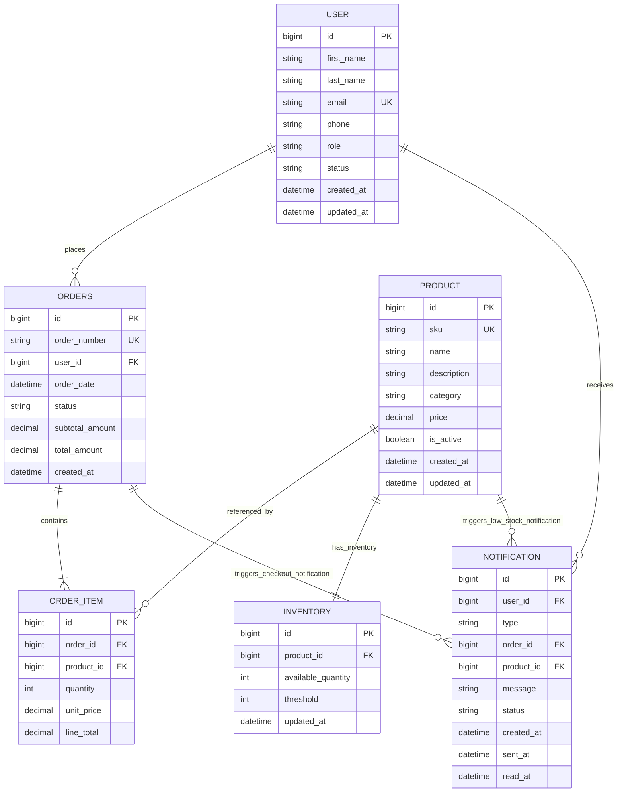

# ER Diagram Guideline (Extremely Detailed)
## Cart Application Backend

Version: 1.0  
Date: 2026-04-14

## 1. Goal of This Guideline
This guideline defines exactly how to design, review, and validate the ER diagram for the Cart Application so the model is consistent with business behavior and implementation constraints.

## 2. Modeling Standard
Use these conventions for every ERD artifact:
- Notation: Crow's Foot (recommended)
- Entity names: singular, PascalCase (User, Product, Inventory)
- Table names in DB: snake_case plural where appropriate (users, products, orders)
- Primary keys: id on every entity
- Foreign keys: <referenced_entity>_id format
- Enums: represented as attribute + allowed values note
- Mandatory fields: mark as NOT NULL
- Optional fields: mark as NULL
- Unique fields: explicit UNIQUE marker
- Relationship labels: use verb phrases (places, contains, tracks, receives)

## 3. Canonical Entity Set
The core ERD must include exactly these entities:
- User
- Product
- Inventory
- Orders
- OrderItem
- Notification

## 4. Entity-by-Entity Attribute Specification

### 4.1 User
Business purpose: actor who places orders or manages catalog/stock.

Attributes:
- id: BIGINT, PK, auto-generated, NOT NULL
- first_name: VARCHAR(100), NOT NULL
- last_name: VARCHAR(100), NOT NULL
- email: VARCHAR(255), NOT NULL, UNIQUE
- phone: VARCHAR(20), NULL
- role: ENUM(ADMIN, CUSTOMER), NOT NULL
- status: ENUM(ACTIVE, INACTIVE), NOT NULL, default ACTIVE
- created_at: TIMESTAMP, NOT NULL, default current timestamp
- updated_at: TIMESTAMP, NOT NULL

Indexing:
- unique index on email
- index on role (optional but useful for admin notification fan-out)

### 4.2 Product
Business purpose: purchasable item in catalog.

Attributes:
- id: BIGINT, PK, auto-generated, NOT NULL
- sku: VARCHAR(64), NOT NULL, UNIQUE
- name: VARCHAR(200), NOT NULL
- description: TEXT, NULL
- category: VARCHAR(100), NULL
- price: DECIMAL(12,2), NOT NULL, check price >= 0
- is_active: BOOLEAN, NOT NULL, default true
- created_at: TIMESTAMP, NOT NULL
- updated_at: TIMESTAMP, NOT NULL

Indexing:
- unique index on sku
- index on category (optional)
- index on is_active for product listing filter

### 4.3 Inventory
Business purpose: stock state for each product.

Attributes:
- id: BIGINT, PK, auto-generated, NOT NULL
- product_id: BIGINT, FK -> Product.id, NOT NULL, UNIQUE
- available_quantity: INT, NOT NULL, check available_quantity >= 0
- threshold: INT, NOT NULL, check threshold >= 0
- updated_at: TIMESTAMP, NOT NULL

Relationship meaning:
- one product has one inventory record
- one inventory record belongs to one product

Indexing:
- unique index on product_id
- index on available_quantity and threshold for low-stock scans

### 4.4 Orders
Business purpose: header record for a checkout event.

Attributes:
- id: BIGINT, PK, auto-generated, NOT NULL
- order_number: VARCHAR(50), NOT NULL, UNIQUE
- user_id: BIGINT, FK -> User.id, NOT NULL
- order_date: TIMESTAMP, NOT NULL
- status: ENUM(PENDING, PLACED, CANCELLED, FAILED), NOT NULL
- subtotal_amount: DECIMAL(12,2), NOT NULL, check subtotal_amount >= 0
- total_amount: DECIMAL(12,2), NOT NULL, check total_amount >= 0
- created_at: TIMESTAMP, NOT NULL

Indexing:
- unique index on order_number
- index on user_id
- composite index on (user_id, created_at)
- index on status

### 4.5 OrderItem
Business purpose: line-level product snapshot inside an order.

Attributes:
- id: BIGINT, PK, auto-generated, NOT NULL
- order_id: BIGINT, FK -> Orders.id, NOT NULL
- product_id: BIGINT, FK -> Product.id, NOT NULL
- quantity: INT, NOT NULL, check quantity > 0
- unit_price: DECIMAL(12,2), NOT NULL, check unit_price >= 0
- line_total: DECIMAL(12,2), NOT NULL, check line_total >= 0

Recommended constraints:
- unique (order_id, product_id) if duplicate product lines are disallowed
- if duplicates are allowed, remove unique constraint and aggregate in service layer

Indexing:
- index on order_id
- index on product_id

### 4.6 Notification
Business purpose: auditable system messages for order confirmation and low stock.

Attributes:
- id: BIGINT, PK, auto-generated, NOT NULL
- user_id: BIGINT, FK -> User.id, NOT NULL
- type: ENUM(CHECKOUT_CONFIRMATION, LOW_STOCK), NOT NULL
- order_id: BIGINT, FK -> Orders.id, NULL
- product_id: BIGINT, FK -> Product.id, NULL
- message: TEXT, NOT NULL
- status: ENUM(PENDING, SENT, READ, FAILED), NOT NULL, default PENDING
- created_at: TIMESTAMP, NOT NULL
- sent_at: TIMESTAMP, NULL
- read_at: TIMESTAMP, NULL

Conditional integrity rules:
- if type = CHECKOUT_CONFIRMATION: order_id must be NOT NULL
- if type = LOW_STOCK: product_id must be NOT NULL
- optional strictness: enforce one of (order_id, product_id) must be present

Indexing:
- index on user_id
- index on type
- index on status
- index on created_at

## 5. Relationship Map with Cardinality and Optionality
Draw these relationships exactly:

1. User to Orders
- cardinality: User 1 to many Orders
- optionality: Orders.user_id is mandatory
- verb: User places Orders

2. Orders to OrderItem
- cardinality: Orders 1 to many OrderItem
- optionality: OrderItem.order_id is mandatory
- verb: Orders contains OrderItem

3. Product to OrderItem
- cardinality: Product 1 to many OrderItem
- optionality: OrderItem.product_id is mandatory
- verb: OrderItem references Product

4. Product to Inventory
- cardinality: Product 1 to 1 Inventory
- optionality: Inventory.product_id is mandatory and unique
- verb: Product has Inventory

5. User to Notification
- cardinality: User 1 to many Notification
- optionality: Notification.user_id is mandatory
- verb: User receives Notification

6. Orders to Notification (optional)
- cardinality: Orders 1 to many Notification
- optionality: Notification.order_id is optional globally, required by type CHECKOUT_CONFIRMATION
- verb: Orders triggers checkout Notification

7. Product to Notification (optional)
- cardinality: Product 1 to many Notification
- optionality: Notification.product_id is optional globally, required by type LOW_STOCK
- verb: Product/Inventory state triggers low-stock Notification

## 6. Referential Actions (Delete/Update Rules)
Recommended FK behavior:
- User -> Orders: ON DELETE RESTRICT, ON UPDATE CASCADE
- Orders -> OrderItem: ON DELETE CASCADE, ON UPDATE CASCADE
- Product -> OrderItem: ON DELETE RESTRICT, ON UPDATE CASCADE
- Product -> Inventory: ON DELETE RESTRICT, ON UPDATE CASCADE
- User -> Notification: ON DELETE RESTRICT (or SET NULL if business allows)
- Orders -> Notification: ON DELETE SET NULL (preserve audit) or RESTRICT (strict history)
- Product -> Notification: ON DELETE SET NULL (preserve audit) or RESTRICT

Choose one policy and use it consistently across DB and JPA mappings.

## 7. Normalization Rules
Target at least 3NF:
- No repeating groups inside Orders; use OrderItem for line detail.
- Do not duplicate stock fields in Product.
- Do not duplicate user data inside Orders except stable snapshots if explicitly required.
- Keep computed totals either persisted with clear source-of-truth rules or derived consistently.

## 8. Transaction and Consistency Boundaries
Checkout should be modeled as one transaction boundary:
- validate user
- validate products
- validate inventory
- create orders and order items
- decrement inventory
- create notification records

If any step fails, no partial write should remain.

## 9. Diagram Layout Blueprint
Use this physical arrangement for readability:
- Left: User
- Center top: Orders
- Center middle: OrderItem
- Right top: Product
- Right middle: Inventory
- Bottom spanning center-right: Notification

Layout rationale:
- Primary checkout flow reads left to right
- Inventory and Notification branches remain close to Product and Orders

## 10. ERD Review Checklist (Use Before Sign-Off)
- All six mandatory entities are present.
- Every entity has PK and timestamp fields where needed.
- All mandatory business relationships are drawn with correct cardinality.
- Product to Inventory is 1:1 and enforced by unique FK.
- Order to OrderItem is 1:N and mandatory at item side.
- Numeric fields include non-negative checks.
- Unique constraints defined for email, sku, order_number.
- Notification conditional rules are documented.
- No relationship is only implied in code but missing in ERD.
- Naming is consistent between diagram and database scripts.

## 11. Common Modeling Mistakes to Avoid
- Using many-to-many directly between Orders and Product without OrderItem.
- Omitting unique constraint on Inventory.product_id, which breaks true 1:1.
- Storing current Product price in historical order views only by join (loses history); keep unit_price in OrderItem.
- Making Notification polymorphic without integrity rules.
- Using nullable foreign keys where relationship is mandatory.

## 12. Final ER Diagram (Fully Labeled)
This diagram is the authoritative ER view for this BRD and includes all required entities, cardinalities, key markers, and important field-level labels.

Diagram labeling notes:
- `PK` = Primary Key, `FK` = Foreign Key, `UK` = Unique Key.
- `PRODUCT ||--|| INVENTORY` indicates one-to-one mapping; enforce with `UNIQUE(inventory.product_id)` in DB.
- `ORDERS ||--|{ ORDER_ITEM` models mandatory line items on the item side.
- `NOTIFICATION.order_id` and `NOTIFICATION.product_id` are conditional FKs driven by `type`.
- Enum/value rules to enforce outside Mermaid in DDL or application validation:
  - `USER.role`: `ADMIN | CUSTOMER`
  - `USER.status`: `ACTIVE | INACTIVE`
  - `ORDERS.status`: `PENDING | PLACED | CANCELLED | FAILED`
  - `NOTIFICATION.type`: `CHECKOUT_CONFIRMATION | LOW_STOCK`
  - `NOTIFICATION.status`: `PENDING | SENT | READ | FAILED`
- Numeric constraints to enforce in DDL:
  - `price/subtotal_amount/total_amount/unit_price/line_total >= 0`
  - `quantity > 0`
  - `available_quantity >= 0`
  - `threshold >= 0`

## 13. Suggested Final Naming for SQL DDL
- users
- products
- inventory
- orders
- order_items
- notifications

Foreign keys:
- orders.user_id -> users.id
- order_items.order_id -> orders.id
- order_items.product_id -> products.id
- inventory.product_id -> products.id
- notifications.user_id -> users.id
- notifications.order_id -> orders.id
- notifications.product_id -> products.id

## 14. Final Recommendation
Freeze this ERD before coding service logic. Any later schema change in Orders, OrderItem, or Inventory impacts checkout transaction logic and test cases significantly.